# Expected Return Models    Team-3: Kyle, Adam, Jose, Narayan

## Project Overview and Goal
The expected return of a stock (Re) is a critical factor used in determining the Weighted Average Cost of Capital(WACC) for Valuations using a Discounted Cashflow Model. 

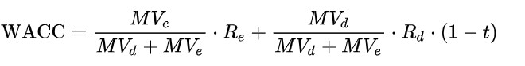

There are many methods available to predict an expected return. However, each method can be a lengthy process of gathering data, preparing the data for analysis, and finaly applying the computation. In this project, we developed three ways of forecasting excess returns using python code and various libraries and APIs. 

**Our goal: **
To build a tool that will create a forecast of expected returns using three different models.

___
## Forecasting Methods 

**Monte-Carlo:**
A simulation-based approach where future stock prices are predicted from the stock's historical performance distribution.  

**CAPM and Fama-French:**
An analytical approach where stock performance is compared to market performance to build a linear model to predict future performance.  

**The CAPM Model**  
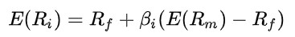 

**The Fama-French 3 Factor Model**  
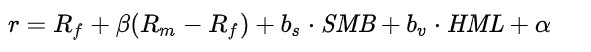 

The method used to calculate the beta factors for CAPM or Fama-French is to use a Linear Regression. An output of the linear regresion is provided below.  

**The Ouput Of a Regression** 
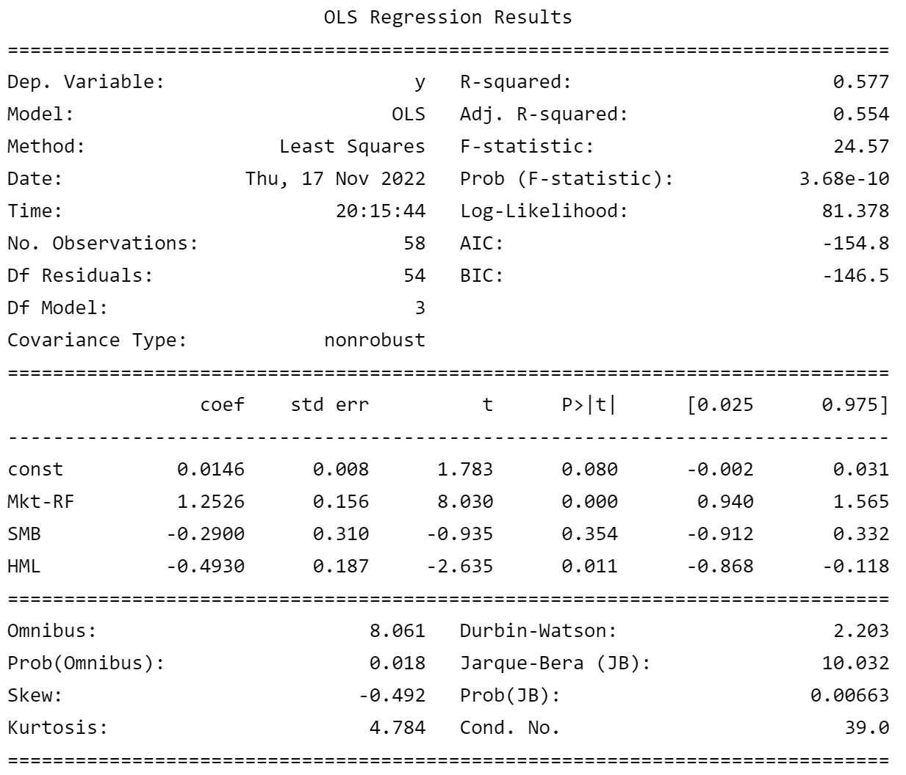
___
## Implementaion

### Data Exploraion: Manually gather and join tables

We initaly gathered data from multiple sources using CSV files, the request libary, and then speclized APIs.

#### Tools used 
**Alpaca API:** We used the alpaca API to pull in stock data for individual stocks. 

**FRED API:** FRED (Federal Reserve Economic Data) will provide you API keys to make pull requests on their data using the request library. FRED will return a JSON file when a request is made. We did not want to parse the JSON file so we looked for other, more straightforward methods  

**FRED Library:**  We found a library to pull the data directly into a pandas data-frame. This method was faster and simpler to use than parsing the JSON file. However, some of our team ran into issues with setting up the libary.  

**Fama-French CSV:** Downloaded and read in data directly a CSV of the Fama-french factors. 

We were able to gather all the data in one place. When we started joining the tables together we ran into multiple data formating issues particuarly with the dates. After spending some time correcting the problems with the dates and data formats, we were able to join the tables togeher. Ultimatly we decided to look for a faster and simpler methdo of gathering the data. 

See *data_cleaning* file in the repo.

### Data Gathering and Cleaning: API pulls

In our initial exploration of the data we found that the data was hard to join together. We decided to look for other ways to gather the data we needed. We found an alternative library called "getFamaFrenchFactors", which directly downloads the data from Kennith French's website and formats the date as a datetime data type. Additionaly, we discoverd that the Fama-French CSV file had the risk free rate data we were planning to get from FRED.  

#### Tools used 
**Alpaca API:** We used the alpaca API to pull in stock data for individual stocks to match the format needed for the Monte-Carlo libary. 
**YFinance:** An unofficial yahoo finance API used to pull stock data from the web. 
**statsmodels.API:** Powerful statical tools API. utilized OLS function for linear regression. 
**getFamaFrenchFactors:** Used to pull Fama-French 3 Factor file directly into our notebooks. 
___

### Analysis 

See Monte_Carlo file in repo for output on Monte-Carlo analysis
See CAPM_FF3_* files for CAPM and Fama-French analysis:

#### Monte-Carlo set up
|Variable|Value|
|--------|-----|
|Prior History:| 5 years|
|Number of Simulations:| 100|
|Forecast Length:| 10 years|
|Time Granularity: |day|

#### CAPM
|Variable|Value|
|--------|-----|
|Prior History:| 5 years|
|Time Granularity:|month|
|Future Risk Free Rate:| rf = 0.33%|
|Future Market Risk Premium:| mkt_rf = 0.61%|

#### Fama-French 3 Factor Model
|Variable|Value|
|--------|-----|
|Prior History:| 5 years|
|Time Granularity:|month|
|Future Risk Free Rate:| rf = 0.33%|
|Future Market Risk Premium:| mkt_rf = 0.61%|
|Future Value Premium:| hml = .38|
|Future Size Premium:| smb = .25|

___

### Results

**Tesla**  
Monte Carlo simulation:
- There is a 95% chance that an initial investment of $100,000 over the next 10 years will end within the range of $1,822.04 and $4,8197,553.24.

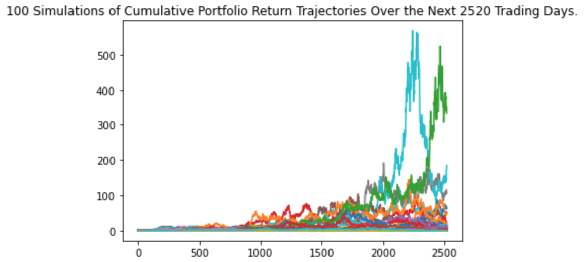

CAPM:
Using the CAPM model, our expected rate of return on TSLA is 21.45%.

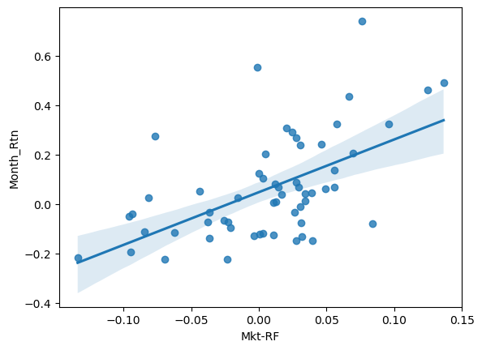

Fama French:
Using the Fama French 3 Factor model, our expected rate of return on TSLA is 15.88%.

Results:
|Method|Value|
|--------|-----|
|Monte Carlo| 44.6%|
|CAPM| 21.45%|
|Fama-French|15.88%|
---

**Xcel**  
Monte Carlo simulation:
- There is a 95% chance that an initial investment of $100,000 over the next 10 years will end within the range of $43,271.86 and $580,805.59.

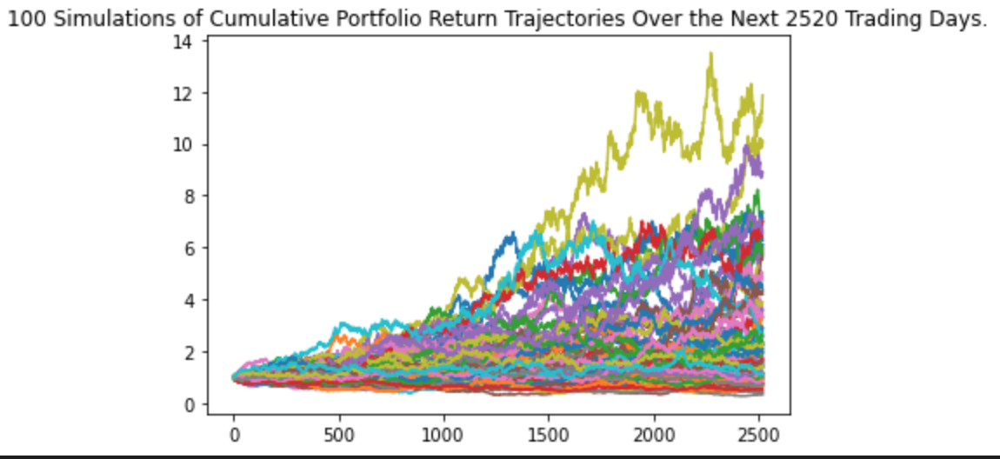

CAPM:
Using the CAPM model, our expected rate of return on XEL is 6.65%.
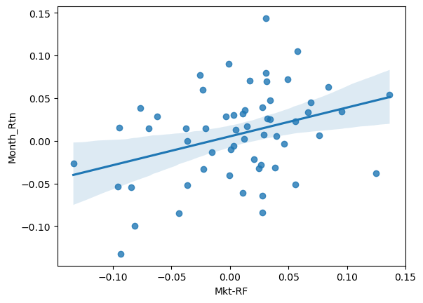

Fama French:
Using the Fama French 3 Factor model, our expected rate of return on XEL is 5.47%.

Results:
|Method|Value|
|--------|-----|
|Monte Carlo| 7.7%|
|CAPM| 6.65%|
|Fama-French|5.47%|
---

**Apple** 
 Monte Carlo simulation:
- There is a 95% chance that an initial investment of $100,000 over the next 10 years will end within the range of $7,949.12 and $3,190,078.26.

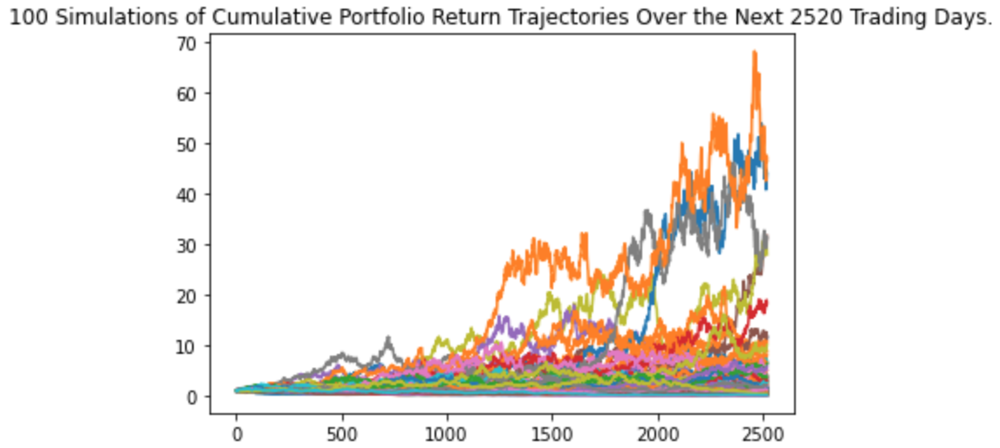

CAPM:
Using the CAPM model, our expected rate of return on AAPL is 13.54%.
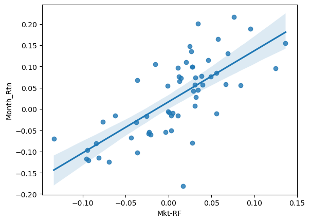

Fama French:
Using the Fama French 3 Factor model, our expected rate of return on AAPL is 10.48%.

Results:
|Method|Value|
|--------|-----|
|Monte Carlo| 15.2%|
|CAPM| 13.54%|
|Fama-French|10.48%|
---

**ESGU**  
 Monte Carlo simulation:
- There is a 95% chance that an initial investment of $100,000 over the next 10 years will end within the range of $64,596.84 and $745,729.65.

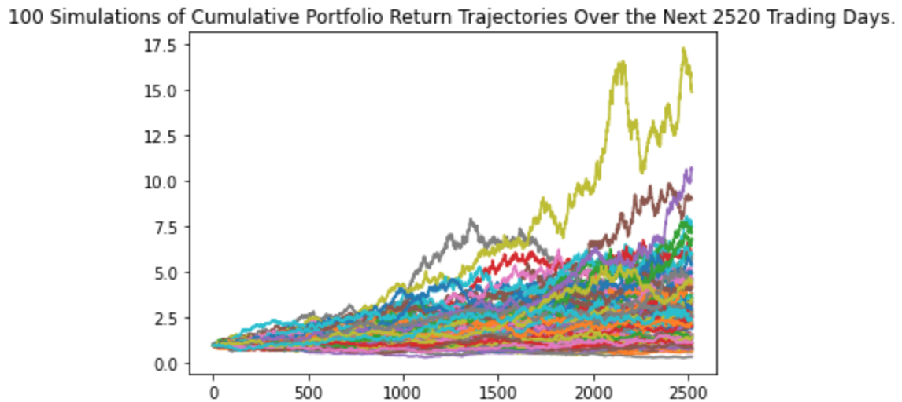

CAPM:
Using the CAPM model, our expected rate of return on ESGU is 11.7%.

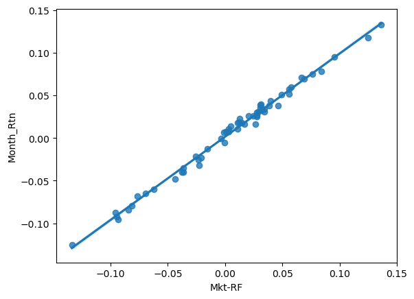

Fama French:
Using the Fama French 3 Factor model, our expected rate of return on ESGU is 11.43%.

Results:
|Method|Value|
|--------|-----|
|Monte Carlo| 10.5%|
|CAPM| 11.7%|
|Fama-French|11.43%|
___

## Outcomes

### Conclusion
The tool allowed us to gather three different expected returns and gave us insight into stocks with high and low correlations to the market. With low-correlation stocks like Tesla, we will need to take additional steps to validate or correct our perspective on the expected return. 

### Lessons Learned

**One source of data is significantly better than multiple sources** 
Different sources use different DateTime formats and data types, creating problems when joining data. This added complexity to the process until we found a single source.

**There is probably a library out there** 
Popular data sources most likely have an open-source library created around them. While these APIs help get your data into your files, they have a limited amount of support around them. A risk is that future updates of python can break the library.

___
### Next Steps
**Calculate WACC:**
With the expected retrun of equity we have a major element in the WACC calculation. From here we would need to gather return on Debt data as well as get total debt to complete WACC calculations.

**Examine Sharpe Ratios:**
The output form all three methods gives us standard deviations as well as expected returns. Using both pieces of data we could calculate sharpe ratios used to compare the returns per unit of risk. 

## Links

WACC
https://en.wikipedia.org/wiki/Weighted_average_cost_of_capital

CAPM
https://en.wikipedia.org/wiki/Capital_asset_pricing_model

FAMA-FRENCH
https://www.investopedia.com/terms/f/famaandfrenchthreefactormodel.asp

FRED API
https://fred.stlouisfed.org/docs/api/fred/

Kennith French's website
https://mba.tuck.dartmouth.edu/pages/faculty/ken.french/data_library.html

ALPACA
https://alpaca.markets/

getfamafrenchFactors API Repo
https://github.com/vashOnGitHub/getFamaFrenchFactors
