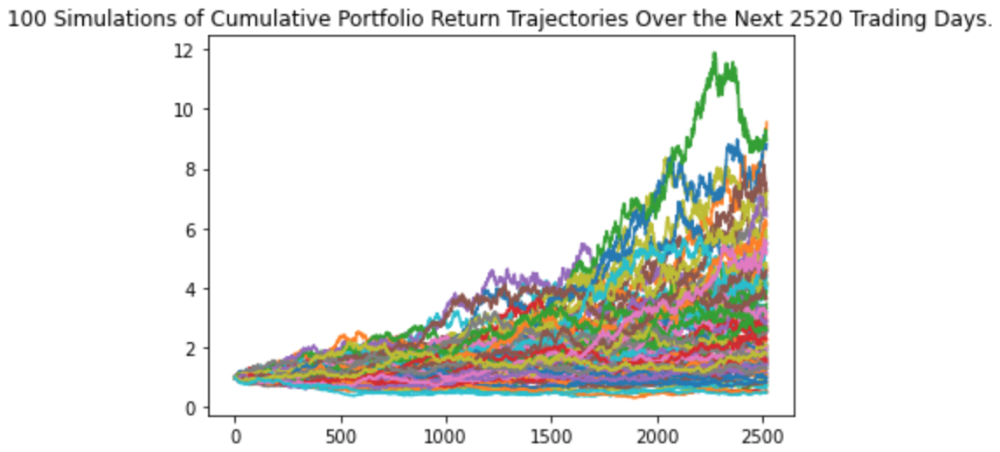
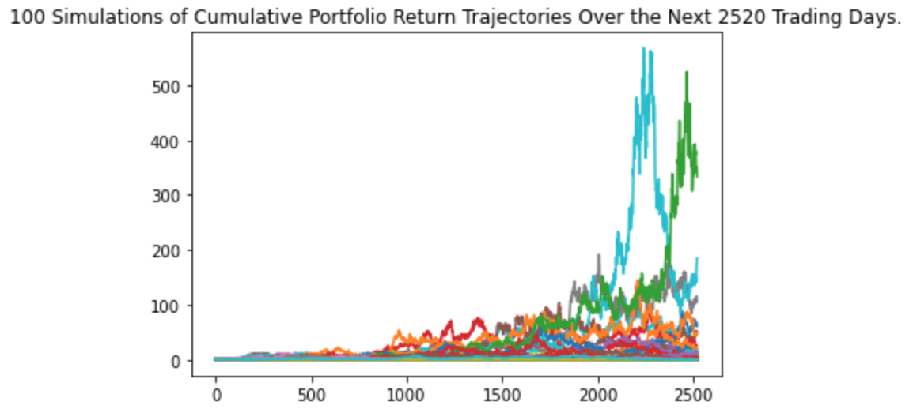
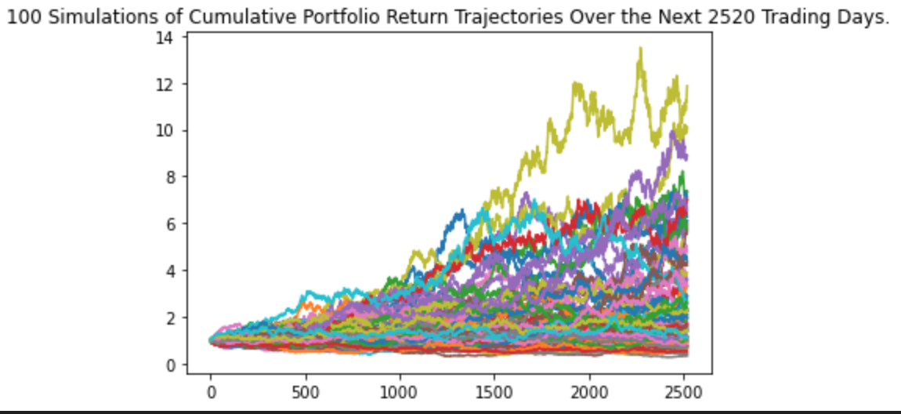
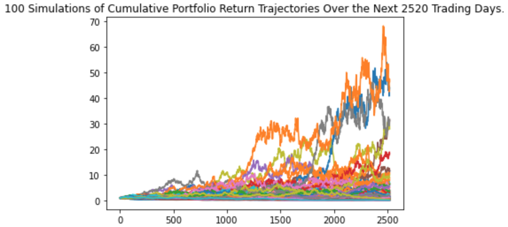
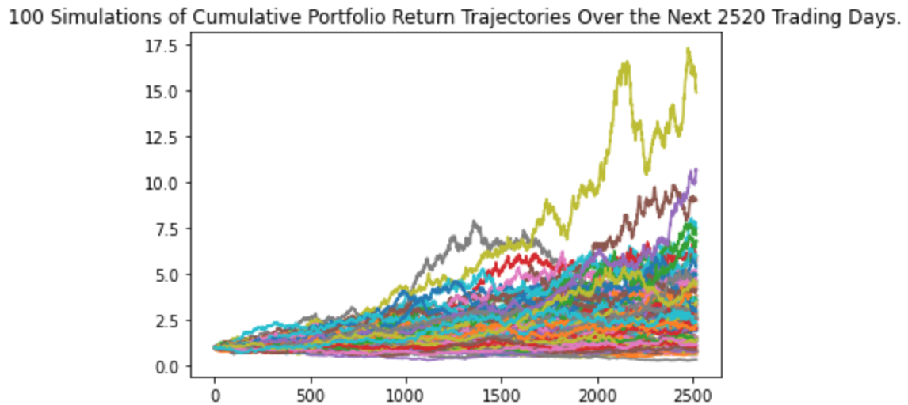

# Team-3-Repo

- **S&P500** Monte Carlo simulation:
- There is a 95% chance that an initial investment of $100,000 over the next 10 years will end within the range of $51,623.38 and $682,658.82

---
---

- **Tesla** Monte Carlo simulation:

- There is a 95% chance that an initial investment of $100,000 over the next 10 years will end within the range of $1,822.04 and $4,8197,553.24

---
---

- **Xcel** Monte Carlo simulation:
- There is a 95% chance that an initial investment of $100,000 over the next 10 years will end within the range of $43,271.86 and $580,805.59

---
---

- **Apple** Monte Carlo simulation:
- There is a 95% chance that an initial investment of $100,000 over the next 10 years will end within the range of $7,949.12 and $3,190,078.26

---
---

- **ESGU** Monte Carlo simulation:
- There is a 95% chance that an initial investment of $100,000 over the next 10 years will end within the range of $64,596.84 and $745,729.65

